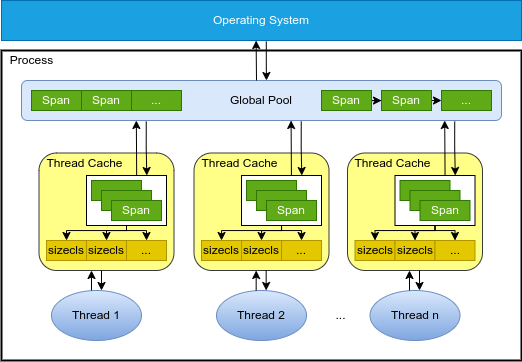
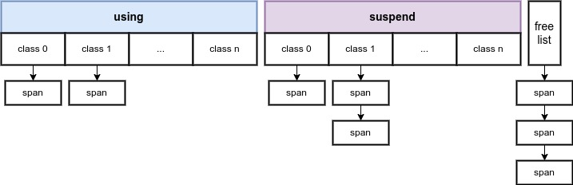
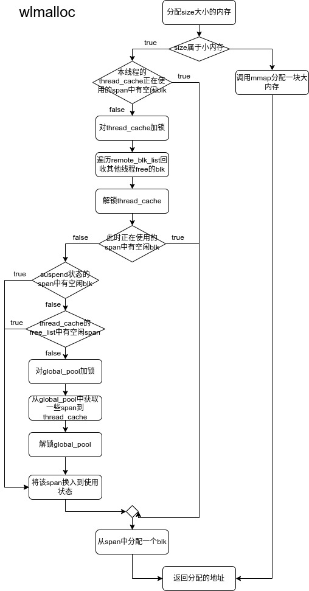
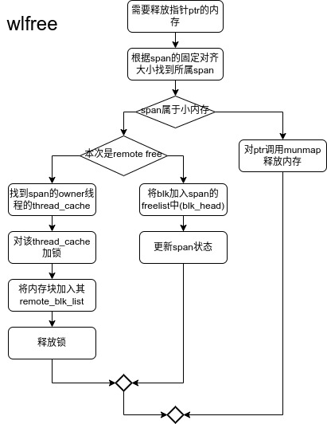
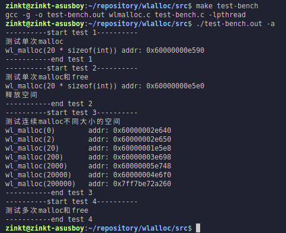
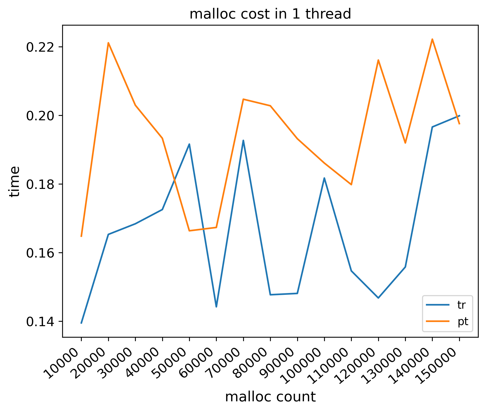
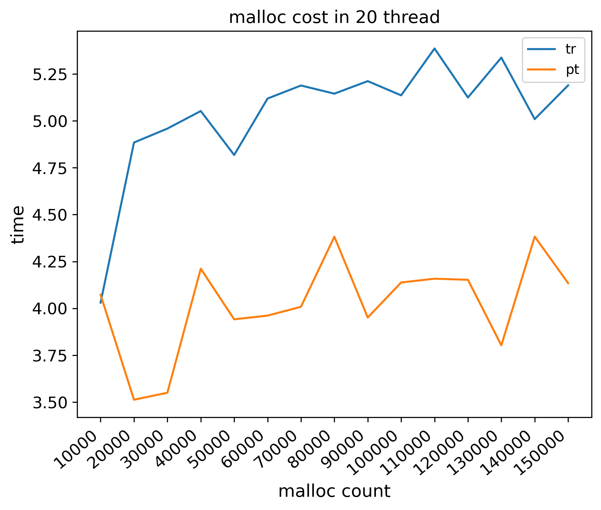
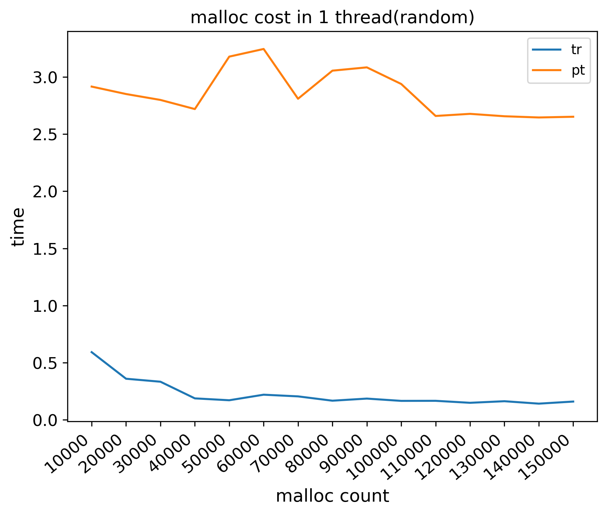
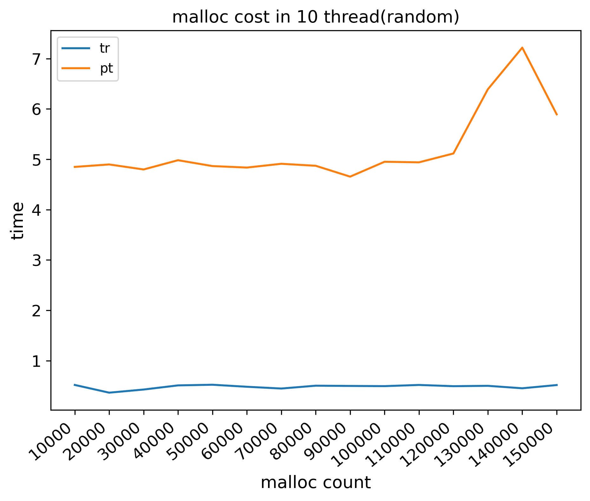

[TOC]

# 摘要

本内存分配器wlmalloc着眼于简化设计、完整实现、快速分配等方面，参考常见动态内存分配器的实现，并加以简化。wlmalloc实现了malloc/free的动态内存分配接口，将其编译为.so库文件，在编写C代码时引入头文件，编译时链接库文件即可使用。并支持多线程的malloc/free操作。
**关键词：**动态内存分配、C POSIX library、多线程

# 项目简介

系统的物理内存是有限的，而对内存的需求是变化的, 程序的动态性越强，内存管理就越重要，选择合适的内存管理算法会带来明显的性能提升。常见的内存分配器有C标准库中的malloc(ptmalloc)，tcmalloc, jemalloc等。这些商业分配器的实现方式都较为复杂，对于初学者极不友好，因此本学年设计课程所设计的wlmalloc着眼于简化设计、完整实现、快速分配等方面，使用C语言开发了这个可用的内存分配器。


# 1. 设计思路

## 1.1 整体架构


为了支持多线程和高并发，wlmalloc从线程级别进行内存的分配和释放。每个线程绑定了一个线程缓存thread_cache，线程根据自己的需要从绑定的thread_cache中获取内存，减少了不同线程对锁的争用，从而保证了较低的分配延迟。

一个进程在第一次调用wlmalloc分配内存时，会预先向操作系统申请一块大内存作为内存池global_pool。在某个线程有内存分配需求时，如果此时其thread_cache中没有可用的内存块span，那么该线程将会从global_pool中获取acquire_cnt个span（取决于向global_pool申请的次数），将其中一个绑定到对应的大小类用于分配，剩余的绑定到thread_cache的free_list中，便于后续的内存申请，减少锁的使用。

如果global_pool中的span都已经分配出去，wlmalloc会通过```syscall_alloc```再次预分配一块大空间。

## 1.2内存块(span)结构

内存块(span)是global_pool和thread_cache之间传输的基本单元。tcmalloc等的内存块组织方式为页表，过于复杂，出于设计简化的目的，每个span有固定大小，由两部分组成：
- 块头：储存span的元数据(metadata)
- 64KB块体：存储数据，由不同大小的block组成，block的大小和数量由所设置的大小类决定。
其结构如图所示：


每个span被初始化时都将被设置一个大小类(size class)，块体根据这个大小类切分若干个数据块。根据实际应用的需求，以及参照了一些经典的内存分配器，wlmalloc使用了两种类型的大小类：
对于小跨度的大小类，按照8B为单位递增；对于大跨度的大小类，增长公式为：
$$
a_n=1.5a_{n-1}\\
a_{n+1}=2a_{n-1}
$$
例如，首先$a_0$=256B，产生大跨度的前两个大小类384B和512B，依此类推。

线程发出内存请求后，wlmalloc根据请求大小分配一个数据块(block)给该线程。显然，相同长度的块体，使用较小的大小类时，将会切割得到更多的数据块。对于实际应用程序，往往循环分配小块内存，分大内存块的请求频率较低，这种设置在一定程度上保证内存的高利用率。对于大于64KB的内存请求，wlmalloc将通过系统调用（mmap）重定向到操作系统。

元数据维护了span的信息，如大小类、空闲数据块数量、空闲数据块链表、所属的线程等。只在一个span中管理元数据，减少了空间浪费，同时便于管理，在对数据块分配或释放时也有更好的性能。

## 1.3 thread_cache结构

thread_cache由线程各自维护，线程根据它来找到合适的内存块，结构如图所示：



本地堆中的所有内存块可以分为4类：

- using：正在使用且仍有空闲数据块的span。在实际应用程序发出内存请求后，wlmalloc将根据传入的大小参数计算出对应的大小类，然后使用该大小类找到当前正在使用的内存块，并从中分配数据块
- full：在对一个内存块请求若干次后，该span已没有可用的空闲块
- suspend：部分被free的span。当full块中一个数据块被free时，变为waiting块
- clean：指一个所有空闲数据块都被free的内存块。当waiting块中的所有数据块都被free时，变为clean块，它将被放入free list

下图展示了span的状态机：


## 1.4 global_pool结构

global_pool从操作系统获取一块大内存对其进行维护，结构如下：


global_pool将获取的内存以 64KB+sizeof(span) 为边界开始切分，将整个堆切分为若干个内存块。

在初始状态时，所有的块都是可用的，由一个指针```free_start```指向，此时```start```也指向同一地址。

全局堆优先分配未使用的内存块，没有足够的空闲内存可切分span分配出去时，global_pool将在空闲块链表中获取span，该链表记录了所有由本地堆归还的span。如果空闲链表也为空值，那么将通过```syscall_alloc```函数扩大global_pool。


# 2. 具体实现

## 2.1 数据结构

### 2.1.1 span

```c
定义了内存块的元数据
struct span_s
{
    tcache_t *owner;
    uint8_t cls;
    uint32_t blk_size;
    //blk_cnt = SPANDATA_SIZE/blk_size
    span_state_t state;

    void *free_blk; //当前可直接分配的blk
    uint32_t free_raw_cnt;  //连续的blk数（即完全没被用过的blk数）
    uint32_t free_total_cnt;    //所有空闲的blk数（包括在dlist中的） 

    dlist_node_t blks_head, blks_tail;

    list_head list;   //管理span自己
};
```
可以看到，元数据记录了内存块的所属线程、大小类、每个数据块的大小(总个数可以计算得到)。除此之外，```free_raw_cnt```记录了未使用的空闲数据块数量，```free_total_cnt```记录了空闲数据块的总数，包括未使用的数据块和已经被释放的数据块。结构体中还有FIFO链表，已经被释放的数据块将会放到空闲数据链表上。

### 2.1.2 thread_cache

定义了thread_cache
```c
struct tcache_s
{
    //被其它线程free的时候使用，基本无影响
    pthread_mutex_t lock;

    //当前正在使用的span
    span_t *using[DEFUALT_CLASS_NUM];    

    //已使用过的span   
    list_head suspend[DEFUALT_CLASS_NUM];

    //可用span的链表头
    list_head free_list;   

    //非本线程free的block
    list_head remote_blk_list;

    //让tc被串起来(thread_metadata中)
    list_head list;
    
    //申请span的次数，用于"慢启动"
    //由SLOW_STARTS多个span开始，每次向pool申请时，
    //额外申请2*acquire_cnt个span连接到free_list
    uint32_t acquire_cnt;

    //占位空span
    span_t vacant;
};
```

thread_cache中记录了正在使用的内存块以及后台挂起内存块链表，可以根据内存大小需求进行快速匹配，取得合适的内存块。为了支持多线程操作，加入了线程锁和空闲链表来记录被其他线程free的内存块。


### 2.1.2 global_pool

结构较为简单，除了锁之外，主要有3个指针记录地址以及一个空闲内存块链表。
```c
//提供span和大内存请求
struct gpool_s
{
    pthread_mutex_t lock;
    void *start;
    void *end;
    void *free_start;
    //各线程返回的span
    list_head free_list;
};
```

## 2.2 内存分配-wl_malloc

每个线程的内存会从其所属的thread_cache处分配，当thread_cache中的span用尽时，将会从global_pool处获取新的span。具体细节如图：



## 2.3 内存回收-wl_free

free包含local free和remote free两种情况，每种情况中又包含大内存块和小内存块释放两种情况。

+ local free:归还本线程申请的内存。
+ remote free:归还其它线程申请的内存。
+ 小内存块free:当free的内存块<=65536B时，此时需要将内存块加入该内存块所属chunk的freelist中。
+ 大内存块free:当free的内存块>65536B时，此时需要将内存块通过munmap函数归还给内存。

内存回收算法:



**值得注意的是，在free过程中对另一个线程的本地堆加锁之后，并不影响被被加锁进程的free操作，并且对被加锁进程的malloc影响有限**，这是因为进程在本地堆中的free操作并不需要加锁，而且进程在本地堆中的malloc仅仅在一个span满了之后才会尝试获取该本地堆的锁，并回收remote freelist中的内容，但这种冲突情况出现的概率较低，并不会对性能造成很大的影响。

# 3. 测试

## 3.1 功能测试

进入src/目录，执行`make test-bench -a`执行所有测试用例



其中：
- test1,2测试单次malloc和free的正确性
- test3测试测试连续malloc不同大小的空间时的正确性
- test4测试多次malloc和free的正确性

## 3.2 性能测试

进入benchmark/目录，执行./run_tests.sh即可执行所有测试用例（也可分别执行），其中使用static_analy.py生成统计图，保存在benchmark/images下

- 性能测试1：测试在单线程一次申请256字节的情况下，对wlmalloc和标准库ptmalloc执行15轮测试，每轮malloc次数为10000次，累计150000次。如图所示，与标准库相差不大：

  

- 性能测试2：测试20个线程，一次申请256字节的情况下对wlmalloc和标准库ptmalloc执行15轮测试，每轮malloc次数为10000次，累计150000次。如图所示，可见，在多线程环境下，wlmalloc的效果不如标准库ptmalloc：

  

- 性能测试3：测试在单线程一次随机大小字节（0-65536）的情况下，对wlmalloc和标准库ptmalloc执行15轮测试，每轮malloc次数为10000次，累计150000次。如图所示，轮数越多，wlmalloc的分配时间越短，这是由于wlmalloc的设计中，假定分配量较大，采用了一种"慢启动"的策略，每次向global_pool申请span时，都会将下次申请的span数量翻倍，因此分配次数越多，所需时间越短。

  

- 性能测试4：测试在10个线程下，一次随机大小字节（0-65536）的情况下，对wlmalloc和标准库ptmalloc执行15轮测试，每轮malloc次数为10000次，累计150000次。如图所示，与性能测试3相似，分配次数越多，分配所需时间越短，使得wlmalloc多线程性能稍差的情况不那么明显。

  

# 4. 使用方式

1. 直接使用源代码，与项目一同编译
2. 动态链接库的方式
   1. 进入src/目录，执行`make so`，即可得到libwlmalloc.so动态链接库文件
   2. 在项目中引入头文件`#include "wlmalloc.h"`
   3. gcc编译时链接库文件`-lwlmalloc`

# 5. 总结与展望

wlmalloc这个内存分配器是一个简化的内存分配器，它设计简单，易于拓展，方便进行学习，使我对C语言、内存、编译与链接都有了更深入的理解。

wlmalloc并不完善，它的多线程效果欠佳，有待进一步优化；实际使用效果测试不够完善，还需进一步测试。

# 6. 参考文献

[1]mmap(2) — Linux manual page［DB/OL］https://man7.org/linux/man-pages/man2/mmap.2.html

# 7. 附录

源代码见附件


